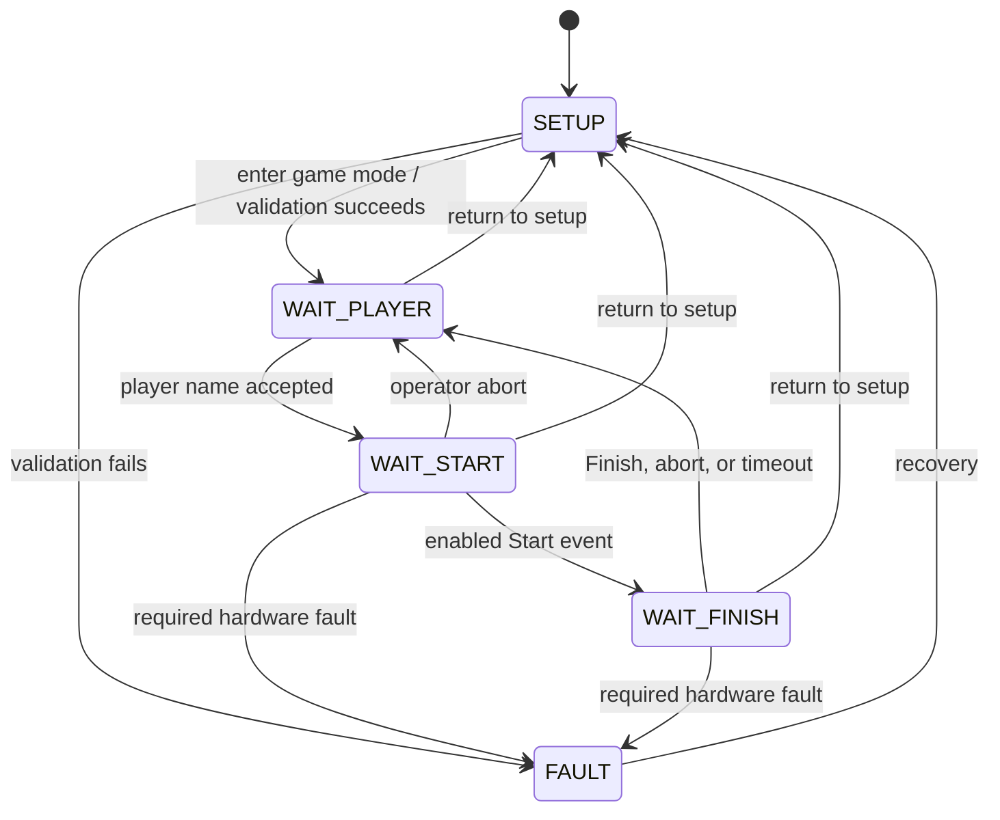

# Laser Parkour Firmware

## Purpose

Laser Parkour is a timed obstacle game consisting of a start button, a finish
button, and a configurable laser maze. A player starts a run by pressing the
start button, passes through the maze, and presses the finish button. Breaking
a laser beam adds a configurable time penalty. The player with the lowest
penalized time wins.

This document defines the requirements and development plan for a clean-room
rewrite of the controller and node firmware. The existing, tested hardware is
treated as fixed. The old code in `Sketches/` can be used as a behavioral
reference, but is not the basis of the new implementation.

## Terminology

- **Controller:** Raspberry Pi Pico W running the game, bus, user interface,
  and web server.
- **Node:** An ATtiny85 board connected to the sensor bus.
- **Laser node:** A node using an LDR to monitor one laser beam.
- **Start/finish node:** A node using the large button instead of an LDR.
- **Raw time:** Time between accepted start and finish events.
- **Score time:** Raw time plus all penalties.
- **Interruption:** One accepted transition from an unbroken to a broken beam.

## Game Rules

1. The operator deliberately switches the controller from setup mode to game
   mode.
2. The controller waits for one player name. There is no player queue in the
   initial implementation.
3. A run can wait for Start only when:
   - setup has been completed;
   - exactly one start and one finish node are present;
   - at least one laser node is present;
   - every expected node is responding; and
   - every laser beam is currently unbroken.
4. Before accepting a start, the controller resets every node event counter,
   verifies that all laser counters are zero, and records the button-counter
   baselines.
5. The player presses the start button. The controller timestamps the event and
   starts the run.
6. During the run, each accepted laser interruption increments the interruption
   count and produces audible feedback.
7. The player presses the finish button. The controller timestamps the event,
   calculates the score, stores the result, and updates the web interface.
8. The controller returns directly to waiting for the next player name.

The score is calculated as:

```text
score_time = raw_time + interruption_count * penalty_time
raw_time   = finish_timestamp - start_timestamp
```

The scoreboard is ordered by score time. If two score times are equal, the
lower penalty sum wins; if both are equal, the earlier completed run is listed
first.

The following values must be configurable in setup mode and persisted by the
controller:

| Setting | Unit | Initial default | Valid range |
|---|---:|---:|---:|
| Penalty per interruption | seconds | 5 | 0 to 240 |
| Maximum run time | minutes | 10 | 1 to 60 |
| Player-name length | characters | 32 | 1 to 32 |

The penalty is configurable in the web setup view. A changed value applies to
subsequent runs and does not recalculate stored scores.

An operator can abort player preparation or an active attempt. An aborted attempt is shown
in recent activity but is not included in the top-ten scoreboard. A run that
exceeds the maximum run time is automatically aborted.

Invalid button events are ignored and logged: finish while no run is active,
start while a run is active, and repeated button events caused by contact
bounce. Start and finish buttons must be debounced in the node firmware. A
press is accepted immediately on its first active edge so debounce does not add
latency to the measured time. The node then ignores all button edges until the
button has been continuously released for the default 50 ms release-debounce
interval. The interval can later be adjusted at build time.

## System States

The controller owns all game state. Nodes only own their identity,
configuration, current input state, and event counters.

| State | Description | Allowed transitions |
|---|---|---|
| `SETUP` | Discover, commission, calibrate, and test nodes | `WAIT_PLAYER`, `FAULT` |
| `WAIT_PLAYER` | Game mode; waiting for one player name | `WAIT_START`, `SETUP`, `FAULT` |
| `WAIT_START` | Player prepared; waiting for an enabled Start button | `WAIT_FINISH`, `WAIT_PLAYER`, `SETUP`, `FAULT` |
| `WAIT_FINISH` | Timer and interruption counting active | `WAIT_PLAYER`, `SETUP`, `FAULT` |
| `FAULT` | Required hardware is missing or inconsistent | `SETUP`, or `WAIT_PLAYER` after validation |



Submitting a player name enters `WAIT_START`. A Start event is accepted only
in `WAIT_START`, while Start is enabled, and while all beams are clear. A
Finish event is accepted only in `WAIT_FINISH`. All other Start and Finish
events are ignored and logged without changing state.

Entering `WAIT_START` includes a preparation step: the controller waits until all
beams are clear, sends `Reset counters` to every node, reads the counters back,
and enables the start event only after the reset is verified. Laser
interruptions between rounds are therefore discarded and never contribute to
the next player's score. If a laser event occurs after this reset but before
the start button is pressed, the controller immediately dims and disables
Start and begins or resets a three-second clear interval. While any laser
remains broken, the interval is continuously held at zero. Every later
interruption resets it again. Start presses are ignored until every laser has
remained clear continuously for three seconds. The controller then repeats and verifies the
counter reset automatically and re-enables Start; no extra Start press is
consumed by preparation.

Laser events affect the score only in `WAIT_FINISH`. They are ignored in
`SETUP`, `WAIT_PLAYER`, and `WAIT_START` (apart from the Start-readiness rule
above). A valid Finish or an operator abort returns directly to `WAIT_PLAYER`.

Commissioning, configuration, saving, rescanning, Identify, factory reset,
manual counter reset, and diagnostic mode-change commands are accepted only in
`SETUP`. The controller rejects them before prompting for parameters or sending
anything over the bus. Read-only inventory and node-detail commands remain
available in game mode. Entering a player name is accepted only in
`WAIT_PLAYER`, and the enter-game command cannot restart an active game.

At the accepted start timestamp, every laser event counter is zero. The start
button's own counter then contains the new start event; it is compared with the
baseline captured during preparation. The same baseline method identifies the
later finish event without erasing the start event.

## Fixed Hardware

The custom PCBs and level shifting have been built and tested. Custom boards
are connected through a bus, and the number of laser nodes may change whenever
the mobile game is assembled.

Pin numbers below are GPIO numbers on the Pico and port-bit names on the
ATtiny85.

### Controller

| Peripheral | Function | Pico GPIO | External component |
|---|---|---:|---|
| Speaker | Sound output | 5 | - |
| RGB LED | Red | 7 | 220 ohm |
| | Green | 8 | 220 ohm |
| | Blue | 9 | 110 ohm |
| Rotary encoder | A | 11 | Pull-up |
| | Switch | 12 | - |
| | B | 13 | Pull-up |
| LCD | SDA | 14 | - |
| | SCL | 15 | - |

### Nodes

All nodes use an ATtiny85-20U and the same firmware image. The node role and
I2C address are configuration data rather than compile-time options.

| Peripheral | ATtiny GPIO | Physical pin | External component |
|---|---|---:|---|
| LDR or button input | PB3 | 2 | Pull-up |
| Status LED | PB1 | 6 | 220 ohm |

### Sensor Bus

| Function | Pico GPIO | ATtiny pin | Notes |
|---|---:|---|---|
| SCL | 17 | PB2 | Controller is I2C master, I2C0 |
| SDA | 16 | PB0 | Nodes are I2C slaves, I2C0 |
| `FU` event | 19 | PB4 | External pull-up; button nodes only |
| Unused reset net | 18 | RESET | Not available; node PCB reset jumpers are not fitted |

GPIO18 must not be used to reset the nodes: the `AT_RS` net exists in the PCB
design, but the reset jumpers on the assembled node boards are open and will
remain unsoldered. Node event counters are reset through the protocol command;
recovering an unresponsive node requires cycling system power or servicing that
node. `FU` is a shared active-low, open-drain signal. The first active edge of
an armed start or finish button produces one non-blocking 10 ms pulse,
independent of how long the button is held or how its contacts bounce afterward.
The Pico captures a monotonic
microsecond timestamp on the falling edge and then queries both button nodes
over I2C to identify the source. I2C and web processing must not be performed
inside the interrupt handler. The button counters remain authoritative if two
nodes' pulses overlap.

Laser interruptions are obtained by polling and do not use `FU`. The sensor
bus speed is 10 kHz, reduced from the initial 100 kHz after communication
failures appeared on the assembled branched wiring. The selected speed must be
tested with a branch topology representative of the actual installation and
the intended node count.

The controller accepts up to 16 laser nodes plus one start and one finish node,
for 18 nodes total. Normal installations are expected to contain about 8–12
nodes total. Larger inventories remain valid, but their complete polling cycle
is slower at 10 kHz. Branches are part of the intended installation; there is
no single nominal total cable length. Bus qualification must use a topology
representative of the actual installation and record the node count, branch
layout, bus speed, polling time, rise times, and error results. Discovery of
more than 16 laser nodes is a configuration fault and prevents the game from
being armed.

## Node Commissioning and Addressing

An ATtiny85 does not provide a guaranteed unique serial number. Multiple
unconfigured nodes at the same I2C address therefore cannot be distinguished
on one bus. Nodes are commissioned one at a time:

1. Connect only the controller and the unconfigured node, or use an equivalent
   isolated programming fixture.
2. The node starts at the reserved commissioning address `0x08`.
3. In the setup page, assign a free address and select its role: laser, start,
   or finish.
4. The node stores the address, role, and configuration checksum in EEPROM and
   restarts at its assigned address.
5. Label the physical node with its assigned address.

Normal node addresses are `0x10` through `0x6F`. Addresses `0x08` through
`0x0F` are reserved for commissioning and future bootloader use. The
controller rejects duplicate addresses, multiple start nodes, multiple finish
nodes, and unknown protocol versions.

This process uses one firmware binary for every node; no source or build option
is changed per device. Recommissioning and factory reset must be supported.

## Laser Detection

Each laser node samples its ADC input continuously and maintains a filtered
value. Each node has its own persisted threshold. The setup interface displays
the raw and filtered value, current beam state, and threshold, and supports
setting one threshold or applying a value to all laser nodes.

To prevent noise near the threshold from creating events, detection uses:

- a filtered ADC value;
- separate broken and restored thresholds (hysteresis);
- a minimum stable time before accepting either state; and
- an interruption cooldown.

Initial values for development are listed below. They must be validated with
the real LDRs, lasers, ambient lighting, and intended hairstyles/clothing.

| Parameter | Initial value | Notes |
|---|---:|---|
| ADC sample period | 10 ms | 100 samples/second |
| IIR filter weight | 1/16 new, 15/16 old | Matches the old prototype behavior |
| Hysteresis | 16 ADC counts | Applied on opposite sides of the threshold |
| State stable time | 30 ms | Rejects very short changes |
| Interruption cooldown | 500 ms | Prevents one physical pass counting repeatedly |

The interruption cooldown is configurable in the web setup view, both per
laser node and with an apply-to-all action. The configured value is persisted
with the node configuration. The 500 ms value is only the initial default and
must be tuned during physical testing. The initial accepted range is 0 to
5000 ms.

One interruption is counted when the filtered beam state changes from clear to
broken and remains broken for the stable time. A continuously broken beam
counts once. It can count again only after it has returned to clear for the
stable time and the cooldown has elapsed. Different laser nodes count
independently, including simultaneous interruptions.

Each node maintains a monotonic 16-bit interruption counter. The controller
polls the counter and calculates the modulo-16-bit difference from its previous
value; reading it does not clear it. This avoids losing events between polls.
The counter resets only when the node restarts or receives an explicit reset
command. A node restart during a run is a fault and aborts that run.

### Node LED

The node uses these indications, in descending priority:

| Priority | Indication | Timing | Meaning |
|---:|---|---|---|
| 1 | Fast blink | Approximately 4 Hz | An operator requested `IDENTIFY` |
| 2 | Normal blink | Approximately 2 Hz | The node has detected an error |
| 3 | Normal blink | Approximately 2 Hz | The node is uncommissioned |
| 4 | Slow blink | Approximately 1 Hz | A laser beam is broken, or a button remains pressed for at least three seconds |
| 5 | Steady on | — | Normal commissioned operation in setup mode |

`IDENTIFY` lasts four seconds and temporarily overrides every other indication.
Afterward, the LED immediately returns to the highest-priority active state.
Uncommissioned and error states deliberately use the same pattern; their exact
cause is available through the controller and web UI. A commissioned laser is
steady on when healthy and clear and slowly blinks for a broken beam. Identify
remains available only in setup mode.

A commissioned start/finish node is steadily on in setup mode. In game mode,
the controller selects one of three player-guidance indications:

| Controller state | Start LED | Finish LED |
|---|---|---|
| `WAIT_PLAYER` | 5% steady glow | 5% steady glow |
| `WAIT_START`, laser blocked | Regular 1 Hz blink | 5% steady glow |
| `WAIT_START`, Start enabled | 100% steady on | 5% steady glow |
| `WAIT_FINISH` | 5% steady glow | 100% steady on |

The standby glow uses approximately 1.25 kHz hardware PWM, so it appears
steady. It shows that an inactive button node is powered while remaining
clearly subordinate to the active button. The simple instruction to a player
is: **press the brightly illuminated button; if Start is blinking, wait until
it remains brightly and continuously on.** The initial 5% duty cycle must be
confirmed under the expected ambient lighting and may be adjusted after a
physical test.

Pressing a button turns its LED off immediately. Releasing it returns to the
guidance pattern selected by the controller. If it remains pressed for three
seconds, the node changes from off to
the slow 1 Hz hardware blink and continues blinking until release. This visual
behavior does not delay the accepted edge, extend `FU`, or change debounce.

The error blink represents a node/system fault, such as an EEPROM verification
failure. A correctly rejected controller request remains visible through
`LAST_OPERATION_ERROR` and `DIAGNOSTICS.last_result`, but does not by itself
change the LED indication.

Whenever firmware changes from a steady indication into a blinking pattern,
the hardware timer starts with the LED's off half-cycle. A short-lived state is
therefore visible immediately instead of first extending the preceding on
indication.

All periodic LED blinking must be generated by a hardware timer/counter output
(for example an ATtiny output-compare mode or Pico PWM hardware). Blinking must
not use periodic timer interrupts or software delay loops. Firmware may
reconfigure or enable/disable the hardware counter from its normal main-loop
state handling.

## I2C Application Protocol

The protocol is binary, versioned, and common to all node roles. Multi-byte
integers are little-endian. The controller reads and writes a compact register
map; a command mailbox is reserved for operations with side effects. Nodes
never initiate I2C traffic. Protocol constants and register layouts must live
in a shared header used by both firmware targets.

The frequently polled status register includes enough information to detect a
restarted, unconfigured, or faulted node. The initial protocol provides these
operations:

| Operation | Required data |
|---|---|
| Identify | Protocol version, firmware version, role, address, capabilities |
| Read status | Input state, status flags, raw ADC, filtered ADC |
| Read events | Interruption or button-event counter |
| Configure sensor | Threshold, hysteresis, stable time, cooldown |
| Configure identity | Address and node role; commissioning mode only |
| Set operating mode | Setup or game mode |
| Save configuration | Validate and commit configuration to EEPROM |
| Reset counters | Controller preparation command before every run |
| Factory reset | Protected setup command, then restart at `0x08` |

Registers have fixed lengths suitable for the ATtiny85 RAM budget and important
blocks include a CRC. Configuration is written to staging registers, validated,
read back, and explicitly committed. Unknown registers, unknown commands, and
invalid values must leave active configuration unchanged and set an error
status readable by the controller.

The controller polls all nodes at least 10 times per second during a run. It
uses a per-transaction timeout and retries a failed transaction twice. A node
that remains unavailable, reports a restart, or returns invalid data during a
run causes the run to abort. Outside a run it moves the controller to `FAULT`
until a successful rescan and setup check.

The concrete register map, command mailbox, byte layouts, limits, retry
behavior, and initial bus timing are defined in `Firmware/protocol.md`. That
document is normative for both firmware targets.

## Controller Responsibilities

The Pico W firmware is responsible for:

- node discovery, commissioning, configuration, and health monitoring;
- the authoritative game state machine;
- timestamps and score calculation;
- current-player handling, recent results, and top-ten scoreboard;
- persistent configuration and completed results;
- Wi-Fi access point and web server;
- LCD, encoder, RGB LED, and speaker feedback; and
- fault reporting and recovery.

Timing uses the Pico's monotonic hardware timer. There is no external real-time
clock. Durations are stored and calculated as integer microseconds; formatting
and rounding occur only for display.

The operator PC supplies wall-clock time through the web interface. When the
page connects, it sends its current UTC time and local UTC offset. The
controller associates that time with its current monotonic timestamp and
derives completion timestamps for subsequent runs. Each stored result contains
an ISO 8601 completion timestamp including the offset. Client-provided time is
display metadata only and must never be used for duration or score
calculations. Until a client has supplied time after boot, completed runs use
an explicit `time unknown` value. Reconnecting may resynchronize future
timestamps but must not modify existing results.

Slow work such as flash writes, JSON generation, and HTTP handling must not run
in GPIO or timer interrupt handlers. Completed results are persisted after the
finish timestamp has been captured and the score calculated.

## Persistence and Recovery

The controller persists:

- penalty and game settings;
- Wi-Fi SSID, password, and country configuration;
- expected node addresses and roles;
- per-node laser configuration;
- top-ten scores.

Both result collections have a fixed capacity of ten entries, but only the
top-ten successful scores are persisted. The ten most recent completed or
aborted attempts remain in RAM and are intentionally lost on a controller
restart. No additional history is retained. Each entry contains the player
name, raw time, interruption count, penalty used, score time, result status,
and client-derived completion timestamp. A persistent completion sequence
number is used for tie-breaking; client-provided timestamps are never trusted
for ordering.

The first Phase 3 slice maintains both collections in RAM. The serial command
`m` prints the ten most recent attempts newest-first, including aborted
attempts. The command `o` prints the top ten successful scores. The controller
stores the Top 10 in one versioned, CRC-protected LittleFS file and loads it at
startup. Flash is written only when a completed run changes the Top 10.
In `SETUP`, the command `q` asks for confirmation before clearing the Top 10
from RAM and flash. Entering `y` confirms; Return, `n`, or any other response
cancels. The recent-attempt list is not cleared.

The initial implementation deliberately uses one storage file instead of two
recoverable slots. A power loss or manual reset during its short write may
invalidate and lose the complete Top 10; an invalid length, format version, or
CRC is detected at startup and produces an empty list plus a serial warning.
This accepted limitation keeps the implementation small. Player names must be
stored and rendered as UTF-8, validated for length, and escaped before
insertion into HTML.

Nodes persist only address, role, sensor configuration, configuration version,
and checksum. They do not persist game state or interruption history.

After controller power loss, an in-progress run is considered aborted. After a
node power loss, its boot counter changes; a run in progress is aborted. The
system always returns to setup/fault checking before another run can start.

## Web Interface

The Pico W operates as a Wi-Fi access point and serves a responsive interface
for one operator PC. The AP SSID and password are persisted settings that can
be changed in the web setup view. The firmware contains documented factory
defaults so the interface remains reachable after erased or invalid storage;
deployment credentials must not be committed to the repository.

The factory Wi-Fi configuration is:

| Setting | Factory value |
|---|---|
| Country | `DE` |
| SSID | `Laser-Parkour` |
| Password | `nN7o1xt3` |

Changing the SSID or password requires explicit confirmation. The new settings
are validated and stored before the access point is restarted, which will
disconnect the current browser. Invalid settings fall back to the documented
factory defaults on the next boot. A local factory-reset action must restore
those defaults so a bad network configuration cannot permanently lock out the
operator.

### Setup View

The setup view must provide:

- bus rescan and per-node event-counter reset;
- a list of address, role, firmware/protocol version, and connection state;
- an Identify action that flashes the selected physical node for four seconds;
- commissioning, role assignment, and factory reset;
- live raw/filtered LDR value and clear/broken state;
- individual and apply-to-all threshold controls;
- individual and apply-to-all interruption cooldown controls;
- penalty and game settings;
- current Wi-Fi SSID and password, with controls to change them;
- clear indication of every condition preventing game start; and
- a deliberate action to enter game mode.

### Game View

The game view must show:

- connection and system state;
- a player-name input while the controller is in `WAIT_PLAYER`;
- live raw time, interruption count, penalty, and score time;
- the top ten scores;
- the ten most recent attempts;
- the client-derived completion timestamp for each result;
- node or beam faults; and
- operator controls to abort the run and return to setup.

There is no player queue in the initial implementation. A player name is
accepted only in `WAIT_PLAYER`; names submitted during an active attempt are
rejected. Duplicate player names are allowed and blank names are rejected.

The browser receives state updates without reloading the page. Server-Sent
Events are preferred for controller-to-browser updates because the primary data
flow is one-way; ordinary HTTP requests are used for commands. Commands must be
validated against the controller state and return structured success or error
responses. A disconnected browser does not stop an active run.

## Local User Interface

The RGB LED, LCD, encoder, and speaker provide basic operation without relying
on the browser for immediate feedback. The LCD provides detailed information,
the speaker provides immediate game-event feedback, and the RGB LED is reserved
for system health, readiness, and faults. Detailed game state is shown in the
web interface and is not encoded as an RGB color.

### LCD and Encoder

The LCD uses a page-based interface:

- At the top level, rotating left or right switches between pages.
- Clicking enters the selected page.
- Inside a page, rotating scrolls through its fields and available actions.
- Clicking a field selects it or executes its action.
- Editable values use rotate to change and click to confirm.
- Every nested page contains a `Back` action.
- Destructive or disruptive actions require a separate confirmation step.

There is no required wraparound between the first and last page or option.
Encoder input is debounced, and one physical detent produces one navigation
step. Navigation must remain responsive while the game, bus polling, and web
server are active.

The minimum top-level pages are:

| Page | Minimum information or actions |
|---|---|
| Status | Controller state, current player, live/result time, interruptions |
| Sensors | Node counts, beam-ready state, and active fault |
| Network | SSID, password, and web-interface IP address |
| System | Firmware version, rescan, return to setup, and reset actions |

Long values may scroll or be split across multiple views. The exact wording and
field order must be evaluated on the physical LCD.

### Sounds

The speaker provides distinct non-blocking cues for game-state transitions and
accepted laser interruptions. These are the initial values for listening tests:

| Transition or event | Initial sound pattern |
|---|---|
| Enter `SETUP` | 440 Hz for 100 ms |
| Enter `WAIT_PLAYER` from setup | 660 Hz for 90 ms |
| Enter `WAIT_START` | 660 Hz for 80 ms, 40 ms pause, 880 Hz for 100 ms |
| Enter `WAIT_FINISH` / Start accepted | 880 Hz for 150 ms |
| Laser interruption accepted | 220 Hz for 250 ms |
| Start or Finish pressed when not accepted | Two short 300 Hz rejection tones |
| Laser blocks Start and starts/resets the clear interval | 330 Hz followed by 220 Hz warning |
| Three-second interval completes; Start enabled | 660 Hz followed by 880 Hz |
| Finish accepted and return to `WAIT_PLAYER` | 660 Hz for 120 ms, 50 ms pause, 990 Hz for 180 ms |
| Abort and return to `WAIT_PLAYER` | 550 Hz for 100 ms, 40 ms pause, 330 Hz for 150 ms |
| Enter `FAULT` | Three 180 Hz pulses |

Ignored laser changes outside their applicable game state remain silent. An
ignored Start or Finish event produces the rejection cue without changing the
game state. A new cue replaces a cue still playing, so current events are never
delayed behind an audio queue.

Sounds are generated with Pico PWM hardware. Playback must not block timestamp
capture, bus polling, the game state machine, or the web server. The initial
frequencies, durations, and pauses must be finalized by listening tests on the
actual speaker.

### Controller RGB LED

The controller RGB LED is a system-health and fault indicator. Higher-priority
conditions override lower-priority indications.

| Priority | Condition | Initial indication |
|---:|---|---|
| 1 | Internal, storage, or unrecoverable controller fault | Fast red blink |
| 2 | Required node missing, sensor-bus fault, or invalid node configuration | Slow red blink |
| 3 | Wi-Fi access point failed or stopped unexpectedly | Magenta blink |
| 4 | Controller is in setup mode | Yellow with blue heartbeat |
| 5 | Start blocked or three-second clear interval active | Flashing amber |
| 6 | Laser currently broken in game mode | Steady amber |
| 7 | System healthy and ready for operation | Blue heartbeat |

Amber uses full red and approximately 25% green, while setup yellow uses full
red and green. The initial hardware-timed patterns are approximately 4 Hz for fast red, 1 Hz
for slow red, and 2 Hz for magenta. The blue heartbeat is approximately 100 ms
on per second. In the yellow setup indication, red and green remain on while
that blue pulse is added. During boot, blue blinks at approximately 2 Hz. A dedicated
RP2040 PIO state machine generates every periodic pattern without GPIO or timer
interrupts.

During boot and AP startup, the LED blinks blue. Once the access point is
active, has a valid IP address, and the HTTP server is ready to accept requests,
a brief blue heartbeat is shown. The heartbeat is also visible over the yellow
setup indication. When no warning is active, the LED remains off between
blue heartbeat pulses. These indications remain the same throughout all game
states. Loss of the AP or web server removes the heartbeat and activates the
higher-priority AP-fault indication.

Until the AP and HTTP server are implemented in Phase 4, their health input is
not armed and therefore cannot produce a false magenta fault. The input becomes
mandatory once those services are started.

The LED controller receives controller health, storage health, bus/node health,
AP/web health, and setup readiness as separate inputs and selects the
highest-priority active indication in one place. LED patterns must not be
scattered across unrelated modules. Periodic blinking and the heartbeat follow
the hardware-counter requirement defined for LEDs. Exact brightness, blink
rates, and heartbeat timing are finalized on the physical hardware.

## Implementation Language and Build

PlatformIO is the supported development, build, upload, and serial-monitor
workflow in Visual Studio Code. The current project setup is:

- Pico W controller: C++ using the Arduino-Pico core. This provides the Pico W
  Wi-Fi support used by the controller smoke test.
- ATtiny85: C11 with the PlatformIO Atmel AVR platform, AVR-GCC, and AVR Libc.
- Portable tests: a PlatformIO native environment where possible.

The controller and node are independent PlatformIO projects in
`Firmware/controller` and `Firmware/node`. Environment-specific upload
protocols, programmer ports, and local SDK paths should be overridable without
editing committed files. The VS Code PlatformIO extension invokes the same
environments as the CLI commands below.

Third-party libraries should be kept minimal. Compiler warnings are enabled and
treated as errors in continuous integration where practical. Hardware-specific
drivers are separated from game and protocol logic so that state-machine,
scoring, persistence encoding, and protocol tests can run on a desktop host.

Suggested source layout:

```text
Firmware/
  protocol.md
  shared/              Protocol types and portable utilities
  controller/
    platformio.ini
    src/               Production entry point
    smoke/             Preserved combined hardware smoke test
    drivers/           Pico hardware access
    game/              State machine, scoring, and player handling
    bus/               Discovery and node communication
    storage/           Versioned persistent data
    web/               HTTP/SSE server and static assets
    ui/                LCD, encoder, LED, and sound
  node/
    platformio.ini
    src/               Production entry point
    smoke/             Preserved combined hardware smoke test
    drivers/           ADC, EEPROM, GPIO, timer, USI/I2C
    app/               Role behavior and event detection
  tests/               Host-side unit and protocol tests
```

### Hardware smoke tests

Each board has one preserved, combined hardware smoke test. These programs are
kept separate from production firmware so they remain available for assembly
verification and later fault diagnosis. The normal production environments are
the defaults; their `src/main.*` files are currently minimal placeholders.

From `Firmware/controller`:

```sh
# Build the production entry point (default environment).
pio run

# Build or upload the complete controller smoke test.
pio run -e smoke-controller
pio run -e smoke-controller -t upload
```

From `Firmware/node`:

```sh
# Build the production entry point (default environment).
pio run

# Build or upload the complete node smoke test through the Arduino Uno ISP.
pio run -e smoke-node
pio run -e smoke-node -t upload
```

In VS Code, select `smoke-controller` or `smoke-node` in the PlatformIO project
environment selector before choosing Build or Upload. Select `rpipicow` or
`attiny85` to return to production firmware.

The detailed behavior and pass/fail criteria are maintained beside the tests:

- `controller/smoke/README.md` for the access point, serial output, RGB LED,
  speaker, LCD, and encoder;
- `node/smoke/README.md` for the hardware-timed status LED and LDR input.

## Development Roadmap

Each milestone should leave a testable system. Later work must not begin by
depending on an undefined protocol or game rule.

### 0. Specification and Toolchain

- Resolve the open decisions at the end of this document.
- Record maximum tested node count and cable length.
- Create PlatformIO controller, node, and native-test environments with
  warning-clean minimal firmware.
- Document building, uploading, serial monitoring, and running tests from both
  the PlatformIO CLI and VS Code.
- Add code formatting configuration.

**Exit criterion:** both targets build reproducibly through PlatformIO, flash
successfully, and run a basic LED/speaker smoke test. Host tests run through the
PlatformIO native environment.

### 1. Protocol, Nodes, and Controller Bus

Protocol development proceeds as vertical end-to-end slices. A register or
command is not considered implemented until the shared definition, ATtiny node
behavior, Pico controller behavior, automated tests where practical, and a
hardware test all exist. The node and controller bus implementations therefore
develop together rather than completing one target before starting the other.

#### 1.1 Shared protocol foundation

- Maintain the normative register map and command mailbox in `protocol.md`.
- Create a C/C++ compatible shared header containing register addresses, block
  layouts, roles, flags, commands, results, limits, and compile-time size
  assertions.
- Implement the shared CRC-8 routine and host tests, including documented test
  vectors and corrupt-data cases.

**Exit criterion:** the same header compiles warning-free for the Pico, ATtiny,
and native test targets, and all CRC/layout tests pass.

#### 1.2 First hardware slice: identity

- Implement the minimum ATtiny USI-based I2C target transport at commissioning
  address `0x08`: register-pointer selection, coherent read snapshots, and the
  read-only `IDENTITY` register with CRC.
- Implement the Pico sensor-bus initialization on GPIO 16/17 at 10 kHz,
  address probing, `IDENTITY` reading, CRC validation, protocol validation, and
  serial diagnostics.
- Repeatedly read the real node, then test disconnect and reconnect behavior.

**Exit criterion:** the controller discovers one node at `0x08`, validates its
identity and CRwreads, reports disconnection, and
communicates again after reconnection without reflashing either target.

For this hardware test, flash the node through the Arduino Uno ISP first, then
disconnect the ISP signal wires before connecting the sensor bus. Uno D11 and
D13 share the ATtiny PB0/SDA and PB2/SCL pins and must not remain connected
during I2C operation. Common ground and appropriate board power must remain.

#### 1.3 Status, restart detection, and laser events

- Add coherent `FAST_STATUS` and `DIAGNOSTICS` registers to both targets.
- Implement the ATtiny boot counter, ADC sampling/filtering, hysteresis,
  stable-time validation, cooldown, event counter, and hardware-timed status
  LED behavior.
- Implement continuous controller polling, targeting about ten complete cycles
  per second for the normal 8–12-node installation, with modulo-16-bit event
  differences, restart detection, retries, and serial diagnostics.
- Tune initial detection values using the real lasers and representative
  ambient conditions.

**Exit criterion:** deliberate beam breaks count correctly; node restart and
disconnect are detected; and noise, slow threshold crossings, continuous beam
breaks, and repeated movement pass recorded hardware tests.

#### 1.4 Configuration and command mailbox

- Add active/staged sensor configuration registers, validation, CRC-protected
  readback, and the command/result mailboxes on both targets.
- Implement mode switching, counter reset, EEPROM save/verification, identity
  commissioning/address change, and factory reset one operation at a time.
- For every side-effecting command, test lost responses and repeated sequences
  to verify that retries cannot repeat side effects.
- Test interrupted/corrupt EEPROM data and recovery to safe defaults.

**Exit criterion:** one firmware image can be commissioned as each role, retain
valid settings across power cycles, reject invalid writes, reset counters
reliably, and recover through factory reset.

#### 1.5 Button events and complete bus

- Implement immediate button-edge acceptance, release debounce, the fixed
  non-blocking `FU` pulse, and start/finish event counters.
- Implement Pico `FU` timestamp capture, deferred reads of both button counters,
  overlap detection, periodic counter verification, and event-line faults.
- Implement complete discovery/inventory validation. No shared hardware reset
  is available on the assembled node boards.
- Test the normal 8–12-node inventory on a representative branched harness and
  confirm that inventories up to 18 nodes remain accepted;
  record bus speed, branch lengths, rise times, retries, polling rate, and
  errors.

**Exit criterion:** the controller accepts and validates inventories of up to
18 nodes, the normal 8–12-node installation is stable at its measured polling
rate, start/finish events are distinguished and timestamped, and disconnects,
restarts, invalid inventories, and `FU` faults are detected.

### 2. Game Engine

- Implement the controller state machine, player-name handling, timestamp handling,
  between-round counter reset, scoring, aborts, timeouts, and fault transitions.
- Add host unit tests for every state transition and scoring edge case.
- Add speaker game-event feedback and RGB system-health indication.

**Exit criterion:** complete games run through serial/local controls with
deterministic scores and correct behavior for invalid and fault events.

### 3. Persistence

- Implement versioned, atomic controller storage and migration/default handling.
- Store settings, node inventory/configuration, recent attempts, and top scores.
- Test interrupted writes, corrupted records, and both result-list capacity
  limits.

**Exit criterion:** completed data survives reboot and simulated incomplete or
corrupt writes recover without preventing setup.

### 4. Web Interface

- Implement AP configuration, editable persisted credentials, HTTP API, SSE
  state stream, setup view, and game view.
- Implement browser time synchronization and unknown-time behavior.
- Validate and escape all user input.
- Test browser disconnect/reconnect during setup and during a run.

**Exit criterion:** one PC can configure the system and operate a full game,
including queuing the next player, without serial access.

### 5. Local UI and Integration

- Complete LCD/encoder navigation, including SSID, password, and IP display,
  and document all LED and sound patterns.
- Verify RGB priority handling by injecting controller, storage, bus, node, AP,
  web-server, and setup-readiness conditions.
- Run full setup, game, abort, timeout, disconnect, reset, and power-loss tests.
- Measure timing accuracy and worst-case response under simultaneous web and bus
  load.

**Exit criterion:** the assembled game meets all requirements in this document
for repeated multi-player sessions.

### 6. Release and Maintenance

- Document flashing, commissioning, setup, backup/reset, and troubleshooting.
- Record firmware versions and build artifacts.
- Tag the first usable release and maintain a change log.

**Exit criterion:** the system can be rebuilt, installed, commissioned, and
operated using only repository documentation.

## Open Decisions

These decisions do not block the initial toolchain work, but must be resolved
before their corresponding milestone:

- Exact LCD wording and field ordering after physical evaluation.
- Final RGB brightness, blink rates, and heartbeat timing after physical
  evaluation.
- Final sound frequencies and timing after listening tests.
